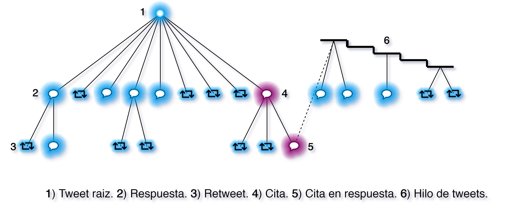

# Dataset de Noticias Chilenas en Español

Dataset creado para el Trabajo de Titulación de pregrado de Ingeniería Civil en Informática de la Universidad de Valparaíso.

---

## Descripción

El dataset incluye una colección de 300 noticias ocurridas Chile que sucedieron entre los meses de junio de 2019 y enero 2020, todas publicadas en Twitter. Los temas más frecuentes en este dataset está la Copa américa 2019, el paro docente, el eclipse solar, el corte de agua en Osorno, y la crisis social. Cada noticia incluye el id de la publicación, el texto de la publicación, fecha y hora de publicación, la etiqueta de veracidad de 4 estados y el árbol de propagación asociada a ésta. La obtención de los datos incluidos en este dataset fue a través del uso de la API de Twitter usando la cuenta gratuita la cual presenta ciertas limitaciones motivo por la cual se omitieron las "citas" en el dataset por lo costoso de obtenerlos todos. Si bien este dataset está pensado para que sea usado en Machine Learning, éste no está dividido en test y train la cual debe hacer este proceso manualmente.

La creación de este dataset fue en base a la necesidad de usar un conjunto de datos en español ya que en trabajos relacionados en la investigación de detección de noticias falsas, que es un área que está su etapa madura, no existe datasets con noticias en español con etiquetas de veracidad, aunque si bien puede ser creado usando la API de Twitter, puede tardar un tiempo en recolectar datos suficientes para trabajar con ello, sobre todo si se se usa la cuenta gratuita de la API, y a eso también se debe sumar el tiempo necesario para poder etiquetar todas las noticias descargadas. 

## Elementos importantes en el dataset

Este dataset tiene una etiqueta de veracidad de 4 estados basándose en la verificación de hechos en el transcurso del tiempo, las cuales son:

- **Noticia No rumor:** publicación realizada casi al mismo tiempo de haber ocurrido los eventos descritos en ella, la cual es considerado un hecho. 
- **Noticia Verdadera:** publicación que lleva un tiempo publicado la cual fue corroborada por medios oficiales.
- **Noticia Falsa:** es aquella noticia cuyo contenido haya estado publicada por un tiempo, se ha desmentido por medios oficiales.
- **Noticia No verificada:** es aquella publicación que hasta la fecha no se ha podido verificar los hechos.

Otro elemento presente en este dataset es el **Árbol de propagación** la cual es el conjunto de reacciones que interactúa con una noticia, en este caso en un tweet, la cual tiene una forma de árbol ya que la publicación sería la raíz y toda interacción de ella como comentarios corresponden a las hojas y subárboles. En términos de este dataset, una publicación es decir un tweet **1)** o un hilo de tweets **6)**, corresponden a la raíz del árbol, cuya publicación se puede propagar a través de retweets **3)**, comentarios **2)**, y citas **4)**, las dos últimas pueden propagarse de la misma forma que una noticia raíz la cual en este caso es considerado como un subárbol tal como se muestra los 3 globos ubicados en el nivel central del árbol de la izquierda.



## Detalles técnicos del dataset

### Distribución de noticias según su estado de veracidad
<ul>
	<li><b>noticias falsas:</b> 53</li>
	<li><b>noticias verdaderas:</b>		87</li>
	<li><b>noticias no rumor:</b>		111</li>
	<li><b>noticias no verificadas:</b>	49</li>
</ul>
<ul>
    <li><b>noticias totales:</b> 300</li>
</ul>


## Descripción de contenido del dataset
El dataset tiene 2 tipos de archivo, el primero incluye el listado de las noticias publicadas en Twitter con su respectiva etiqueta y el segundo archivo incluye el árbol de propagación asociada a esta publicación.

### lista de noticias
Contenido incluido en el primer archivo cuyas tablas son las siguientes:

- **tweet_id:** id del evento en Twitter.
- **texto:** texto de la noticia.
- **fecha de publicación:** Fecha y hora en utc 0 de cuando se publicó la noticia.
- **etiqueta:** Etiqueta de veracidad `Verdadero`, `Falso`, `No Verificado`, `No Rumor`.
- **web de publicación:** web que hace referencia a la publicación hecha en Twitter.
- **Observación:** Observación sobre la publicación.


### objeto retweet en Árbol
Estas tablas pertenece al objeto retweet, uno de los dos objetos incluidos en el segundo archivo.

- **id_usuario:** id del usuario quien hizo el retweet.
- **fecha de publicación:** fecha y hora en utc 0 de cuando se realizo el retweet.
- **timedelta_time:** tiempo transcurrido en minutos desde cuando se publico la noticia original.

### objeto tweet en Árbol
Estas tablas pertenece al objeto tweet, uno de los dos objetos incluidos en el segundo archivo.

- **tweet_id:** tweet_id del comentario.
- **tweet_id_fuente:** tweet_id a quién se está respondiendo.
- **timedelta_time:** tiempo transcurrido en minutos desde cuando se publico la noticia original.
- **fecha de publicación:** fecha y hora en utc 0 de cuando se publico el comentario
- **tweets:** subárbol asociado a esta publicación (véase objeto retweet en Árbol).
- **retweets:** retweets realizado a esta publicación (Véase objeto tweet en Árbol).

## Contenido del dataset en el repositorio

Por [políticas de privacidad de la API de Twitter](https://developer.twitter.com/en/developer-terms/policy#4-e), la distribución del contenido de Twitter fuera de su servicio no está permitido exceptuando los ids, por lo cual en este repositorio se publicará sólo los ids en 2 tipos de archivos en donde el archivo `dataset/etiquetas.txt` incluirá el listado de las noticias acompañada con la etiqueta de veracidad y los archivos `dataset/<id_noticia>/<id_noticia>.min` listará los elementos del árbol.

Extracto del archivo [`dataset/etiquetas.txt`](./dataset/etiquetas.txt) que lista las noticias en ids con su etiqueta de veracidad asociada.
```python

No rumor:1198751152625590273
No rumor:1198949722414878720
No rumor:1200486652206100485
No rumor:1211261870973366272
No rumor:1212216244226678785
Verdadero:1174053089231462405
Verdadero:1183134595883192321
Verdadero:1184107014995136513
Verdadero:1184109880904429570
Verdadero:1184111346113232896
Falso:1203750681460510720
Falso:1207117882796204033
Falso:1207339766347378689
Falso:1207345563555024896
Falso:1207415296715300865
No verificado:1145470228144558080
No verificado:1145843840332550145
No verificado:1146468651773702146
No verificado:1146478448732491777
No verificado:1147593398498603011

```

Extracto del archivo `dataset/<id_noticia>/<id_noticia>.min` que lista las acciones que han ocurrido en una noticia, en este caso, a la noticia de id: [1147594488375853061](./dataset/1147594488375853061/1147594488375853061.min) en donde a la izquierda indica el tipo de acción, seguido del evento en cuestión incluyendo el id del usuario quien ha realizado la acción, el id de dicha de acción y el tiempo transcurrido desde la publicación de la noticia en minutos, y luego a la derecha, aparece el evento a la cual se está interactuando que pude ser la noticia origina o bien un comentario.
```php

retweet: ['3092564962','1147647134293987328','209.20']->['15590302','1147594488375853061','0.0']
retweet: ['395545788','1147746783277322240','605.17']->['15590302','1147594488375853061','0.0']
reply: ['110804769','1147594680219029504','0.77']->['15590302','1147594488375853061','0.0']
reply: ['1655755712','1147594814462013442','1.30']->['15590302','1147594488375853061','0.0']
reply: ['140511078','1147594841020387329','1.42']->['15590302','1147594488375853061','0.0']
reply: ['197185110','1147618254719979522','94.45']->['140511078','1147594841020387329','1.42']
reply: ['140511078','1147673338233458688','313.33']->['197185110','1147618254719979522','94.45']
reply: ['100478953','1147594879033315328','1.57']->['15590302','1147594488375853061','0.0']
reply: ['1074355840377860098','1147594880493006848','1.57']->['15590302','1147594488375853061','0.0']
reply: ['419484554','1147594910310313991','1.68']->['15590302','1147594488375853061','0.0']
reply: ['368668381','1147594932175212545','1.77']->['15590302','1147594488375853061','0.0']
reply: ['824262596','1147595479146008577','3.95']->['368668381','1147594932175212545','1.77']
retweet: ['3406666055','1147597119148187648','10.47']->['824262596','1147595479146008577','3.95']
retweet: ['1199381186','1147599236374106112','18.87']->['824262596','1147595479146008577','3.95']
reply: ['824262596','1147599272608706560','19.02']->['824262596','1147595479146008577','3.95']

```

## Acceso al dataset completo

Cualquier interesado en acceder al dataset personalizado creado en este trabajo para ser usado con fines académicos o de investigación, puede contactarse con desarrollador de este dataset que es daniel.toro@alumnos.uv.cl o la profesora encargada de este trabajo que es eliana.providel@uv.cl. También puede acceder al contenido usando la API a costa de más tiempo y la probabilidad de eventos eliminados incluyendo una noticia entera.

---

*nota: este repositorio no tiene traducción al inglés ya que está pensado a usuarios del habla hispana*

*note: this repositoy no have an english version because this thinked to spanish users.*


